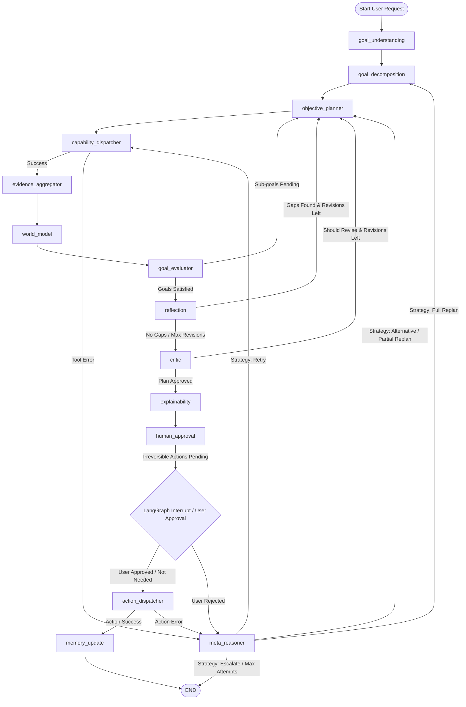

# AtlasAI — Autonomous Goal-Driven Travel Planning Agent

AtlasAI is a state-of-the-art, goal-driven autonomous travel planning system built on top of **LangGraph**, **LangChain**, **Pydantic v2**, **ChromaDB**, and **Streamlit**.

Unlike rigid, rule-based travel assistants or fixed linear chains, AtlasAI operates as an **autonomous reasoning engine**. It continuously evaluates the user's objective, dynamically decomposes goals into prioritized sub-goals, dispatches research tools, synthesizes a world model, self-evaluates through reflection and critique, requests human approval for sensitive financial actions, recovers from failures via meta-reasoning, and updates long-term memory.

---

## Table of Contents
1. [Key Features](#key-features)
2. [System Architecture & Workflow](#system-architecture--workflow)
3. [Graph Node Definitions](#graph-node-definitions)
4. [Central State Schema (`TripState`)](#central-state-schema-tripstate)
5. [Observability & Debugging System](#observability--debugging-system)
6. [Prompt System (.yaml)](#prompt-system-yaml)
7. [Memory Subsystem](#memory-subsystem)
8. [Multi-Agent Architecture](#multi-agent-architecture)
9. [Installation & Setup](#installation--setup)
10. [Execution & Usage](#execution--usage)
11. [Testing](#testing)

---

## Key Features

- **Goal-Driven Reasoning Loop:** Dynamically evaluates "what is the next best action?" to satisfy pending sub-goals without fixed rigid paths.
- **Structured YAML Prompting:** Separates static system personas from dynamic runtime state using cached YAML prompt definitions.
- **Reflection & Critic QA Layer:** Evaluates plans for forgotten considerations (visas, vaccinations, currency, local holidays) and budget feasibility before finalizing.
- **Human-in-the-Loop (HITL) Gate:** Pauses execution using LangGraph `interrupt()` before executing irreversible real-world actions (flight/hotel bookings, payments).
- **Meta-Reasoning & Failure Recovery:** Diagnoses tool failures or rejected user approvals and executes minimal recovery strategies (`retry`, `alternative`, `partial_replan`, `full_replan`, `escalate`).
- **Multi-Tiered Memory System:** 
  - **User Memory:** Semantic long-term user preferences via ChromaDB vector store.
  - **Episodic Memory:** Semantic memory of past trips and lessons learned via ChromaDB.
  - **Tool Memory:** Quantitative latency, success rate, and error tracking via JSON.
- **Dual-File Observability System:** Automatically writes `runtime_<run_id>.json` (structured telemetry) and `trace_<run_id>.log` (human-readable execution log) for every run in `runtime/`.
- **Streamlit Interactive Interface:** Full dashboard featuring real-time node state visualization, chat history, interactive approval cards, and explainability panels.

---

## System Architecture & Workflow

The core planning lifecycle is governed by a **LangGraph StateGraph**. Execution starts at `GOAL_UNDERSTANDING` and proceeds through iterative planning loops, QA gates, human approval, action execution, and memory updates.

### Mermaid Workflow Graph



---

## Graph Node Definitions

The graph consists of 14 specialized nodes, each responsible for a distinct step in the agentic lifecycle:

| Node Name | Component File | Description & Function |
|---|---|---|
| **`goal_understanding`** | `nodes/goal_understanding.py` | Parses raw text input into a structured goal schema (`ParsedGoal`) and retrieves relevant user preferences from memory. |
| **`goal_decomposition`** | `nodes/goal_decomposition.py` | Breaks down the parsed goal into prioritized sub-goals with dependencies and required capabilities. |
| **`objective_planner`** | `nodes/objective_planner.py` | Evaluates pending sub-goals against world facts and formulates the next sequence of tool calls or actions. |
| **`capability_dispatcher`** | `nodes/capability_dispatcher.py` | Pure routing dispatcher that executes research tools (`search_flights`, `search_hotels`, `get_weather`, `check_constraints`) and logs metrics. |
| **`evidence_aggregator`** | `nodes/evidence_aggregator.py` | Merges and deduplicates raw tool results into category-indexed structured evidence. |
| **`world_model`** | `nodes/world_model.py` | Synthesizes accumulated evidence into high-confidence world facts and computes implications (e.g., budget usage). |
| **`goal_evaluator`** | `nodes/goal_evaluator.py` | Evaluates whether world facts satisfy each sub-goal and determines if planning can proceed to QA. |
| **`reflection`** | `nodes/reflection.py` | QA layer node that identifies missing considerations, visa policies, vaccinations, currency exchange, and travel logistics. |
| **`critic`** | `nodes/critic.py` | Independent critic node that audits the overall plan for budget violations, tight layovers, and logical contradictions. |
| **`explainability`** | `nodes/explainability.py` | Formulates structured explainability data containing key tradeoffs, risk factors, and decision rationales for the user. |
| **`human_approval`** | `nodes/human_approval.py` | Pauses graph execution via `interrupt()` if pending actions involve real-world money or bookings, waiting for user confirmation. |
| **`action_dispatcher`** | `nodes/action_dispatcher.py` | Executes confirmed financial or booking transactions (`book_flight`, `book_hotel`, `make_reservation`, `process_payment`). |
| **`meta_reasoner`** | `nodes/meta_reasoner.py` | Diagnoses runtime failures, tool errors, or user rejection and prescribes minimal recovery strategies. |
| **`memory_update`** | `nodes/memory_update.py` | Persists session takeaways, learned user preferences, and episodic summaries into ChromaDB and JSON storage at run completion. |

---

## Central State Schema (`TripState`)

All nodes communicate through a single, shared `TypedDict` defined in `graph/state.py`. Nodes return partial updates, which LangGraph automatically merges into the accumulated state.

```python
class TripState(TypedDict, total=False):
    # --- Input & Goal Parsing ---
    user_input: str               # Raw user prompt text
    parsed_goal: dict             # Serialized ParsedGoal (destination, budget, dates, etc.)
    sub_goals: list[dict]         # List of serialized SubGoal objects

    # --- Planner & Actions ---
    current_plan: list[dict]      # Ordered list of planned actions
    planner_iteration: int        # Counter for planning loop iterations
    planner_reasoning: list[str]  # Chain-of-thought log entries
    planning_complete: bool       # True when planner emits no further actions

    # --- Tool Execution & Evidence ---
    pending_tool_calls: list[dict]# Queue of actions awaiting execution
    tool_results: dict            # Keyed by tool name -> raw outputs
    evidence: dict                # Aggregated evidence organized by category
    world_facts: list[dict]       # List of extracted WorldFact objects

    # --- Quality Assurance (Phase 2) ---
    revision_count: int           # Revisions executed so far
    max_revisions: int            # Maximum allowable QA revision loops
    reflection_gaps: list[dict]   # Gaps identified by reflection node
    critic_should_revise: bool    # True if critic requests plan revision
    critic_feedback: list[dict]   # List of feedback items from critic
    reflection_notes: list[str]   # Qualitative notes from reflection
    explanation: dict             # Structured tradeoffs, risks, and rationales

    # --- Goal Evaluation ---
    goal_status: dict[str, dict]  # Per-subgoal status dictionary
    goal_satisfied: bool          # True when all goals are met
    evaluation_reasoning: str     # Rationale from goal evaluator

    # --- Human Approval & Bookings (Phase 3) ---
    approval_required: bool       # Flag indicating approval is required
    approval_status: str          # pending | approved | rejected
    approval_reason: str          # User feedback if rejected
    booking_results: list[dict]   # Confirmed booking receipts
    payment_results: list[dict]   # Confirmed payment transaction receipts

    # --- Meta-Reasoning & Recovery (Phase 3) ---
    failure_history: list[dict]   # History of encountered errors and strategies
    recovery_attempts: int        # Counter for failure recovery attempts
    max_recovery_attempts: int    # Maximum recovery retries (default: 3)

    # --- Memory & Telemetry (Phase 3) ---
    tool_stats: dict              # In-memory tool performance metrics
    session_summary: dict         # Summary of the current planning session
    memory_context: dict          # Loaded user preferences and past episodes
    errors: list[dict]            # Accumulated error logs
    iteration_count: int          # Global loop counter
    max_iterations: int           # Safety limit for iterations
```

---

## Observability & Debugging System

AtlasAI includes a real-time observability framework (`app/tracing.py`) that automatically generates **two separate output files** in the `runtime/` directory for every single execution (CLI or UI):

```
runtime/
├── runtime_<run_id>.json   # Full structured event telemetry (JSON)
└── trace_<run_id>.log      # Human-readable execution trace log (Text)
```

### 1. Runtime Telemetry (`runtime_<run_id>.json`)
Captures a chronological JSON log of every system event:
- **Event Types:** `Agent Initialization`, `Node Execution`, `Tool Call`, `LLM Call`, `Conditional Routing`, `Memory Operation`, `Human Approval Request`, `Human Approval Response`, `Workflow Completion`.
- **Payload Data:** Exact input parameters, output responses, node state update summaries, and error stack trace details.
- **Computed Summary:** Includes execution time, total node executions, tool invocation counts, unique tools used, and error counts.

### 2. Human-Readable Trace Log (`trace_<run_id>.log`)
Provides a developer-friendly execution log following workflow progression:
```text
════════════════════════════════════════════════════════════
  AtlasAI Execution Trace
  Run ID  : a1b2c3d4
  Started : 2026-08-05 00:22:00
  Request : Plan me a 5-day Japan trip with a budget of 1.5 lakh INR
════════════════════════════════════════════════════════════

[GoalUnderstanding] Started
[GoalUnderstanding] ✓ Success

[GoalDecomposition] Started
[GoalDecomposition] ✓ Success

[ObjectivePlanner] Started
[ObjectivePlanner] Selected: SearchFlights Tool
[ObjectivePlanner] Selected: SearchHotels Tool
[ObjectivePlanner] ✓ Success

[CapabilityDispatcher] Started
[Tool] SearchFlights
       Input  : {"origin": "Delhi", "destination": "Tokyo", "date": "2026-09-01"}
       Status : Success
       Output : 10 items returned

[Router] → EvidenceAggregator Node

[Workflow] Completed Successfully (5.2s)
```

---

## Prompt System (.yaml)

All node system personas and user prompt templates are structured in YAML files located inside `prompts/` and loaded dynamically via `services/prompt_loader.py` with `@lru_cache`:

```
prompts/
├── goal_understanding.yaml
├── goal_decomposition.yaml
├── planner.yaml
├── reflection.yaml
├── critic.yaml
├── evaluator.yaml
├── explainability.yaml
├── world_model.yaml
└── meta_reasoner.yaml
```

Each YAML prompt file clearly isolates the static agent persona (`system_prompt`) from runtime variables (`user_prompt`):
```yaml
system_prompt: |
  You are an expert travel coordinator...
user_prompt: |
  ## Objective
  {user_input}
```

---

## Memory Subsystem

AtlasAI integrates three distinct memory components under `memory/`:
1. **User Memory (`memory/user_memory.py`):** Uses ChromaDB vector store for semantic retrieval of long-term preferences (dietary restrictions, preferred airlines, accommodation styles).
2. **Episodic Memory (`memory/episodic_memory.py`):** Stores past completed trip itineraries and lessons learned in ChromaDB for similarity queries.
3. **Tool Memory (`memory/tool_memory.py`):** Tracks tool invocations, success rates, average latency, and common error patterns in `data/tool_stats.json`.

---

## Multi-Agent Architecture

Under `agents/`, AtlasAI incorporates a multi-agent framework:
- **`CoordinatorAgent`:** Acts as the primary router overseeing specialized delegation.
- **Specialized Agents:**
  - `TravelPlanner`: Flight and transport logistics.
  - `BudgetAnalyst`: Financial constraints and cost estimation.
  - `LocalExpert`: Activities, cultural sights, and dining.
  - `BookingSpecialist`: Booking and reservation transactions.

---

## Installation & Setup

### Prerequisites
- Python 3.10+
- OpenAI, Anthropic, or Groq API Key

### Steps

1. **Clone Repository & Navigate:**
   ```bash
   git clone https://github.com/vatsal1021/Atlas_AI.git
   cd Atlas_AI
   ```

2. **Create & Activate Virtual Environment:**
   ```bash
   # Windows
   python -m venv venv
   .\venv\Scripts\activate

   # macOS/Linux
   python3 -m venv venv
   source venv/bin/activate
   ```

3. **Install Dependencies:**
   ```bash
   pip install -r requirements.txt
   ```

4. **Environment Configuration:**
   Create a `.env` file in the root directory:
   ```env
   LLM_PROVIDER=openai
   LLM_MODEL=gpt-4o-mini
   OPENAI_API_KEY=your_openai_api_key_here
   
   # Optional feature flags (Defaults: True)
   ENABLE_REFLECTION=True
   ENABLE_CRITIC=True
   ENABLE_EXPLAINABILITY=True
   ENABLE_HUMAN_APPROVAL=True
   ```

---

## Execution & Usage

### 1. Interactive Streamlit Web UI
Launch the rich visual web application:
```bash
streamlit run ui/streamlit_app.py
```

### 2. Command Line Interface (CLI)
Run directly from terminal:
```bash
python -m app.main "Plan me a 5-day trip to Tokyo with a budget of 1.5 lakh INR"
```

---

## Testing

AtlasAI features a unit and integration test suite using `pytest`:

```bash
pytest tests/ -v
```

All 80+ test cases cover individual graph nodes, edge routers, tools, memory subsystems, prompt loading, and the dual-file observability engine.
