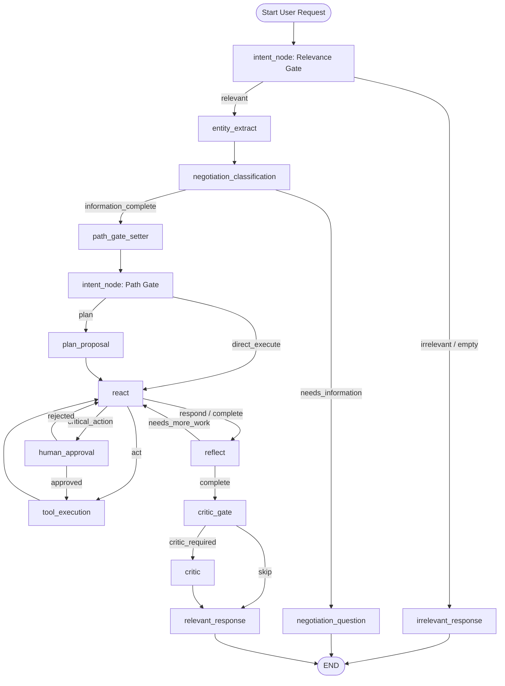

# AtlasAI — Single-Pass Intent-Driven Travel Agent & Chatbot

AtlasAI is an autonomous, goal-driven travel planning assistant and chatbot built on **LangGraph**, **LangChain**, **Pydantic v2**, **ChromaDB**, and **Streamlit**.

Unlike rigid rule-based travel assistants or heavy multi-loop planners, AtlasAI operates as a **single-pass, intent-driven, ReAct-centred agent**. It handles conversational chitchat cleanly without triggering planner machinery, extracts entities across multi-turn negotiations, dynamically reasons and calls research/booking tools via a ReAct loop, evaluates plan completeness through reflection and criticism, interrupts for human approval on irreversible actions, and maintains persistent state across interaction turns.

---

## Table of Contents
1. [Key Features](#key-features)
2. [System Architecture & Workflow](#system-architecture--workflow)
3. [Graph Node Definitions](#graph-node-definitions)
4. [Central State Schema (`TripState`)](#central-state-schema-tripstate)
5. [ReAct & Tool Execution Subsystem](#react--tool-execution-subsystem)
6. [Human Approval Flow](#human-approval-flow)
7. [Observability & Telemetry](#observability--telemetry)
8. [Prompt System (.yaml)](#prompt-system-yaml)
9. [Memory Subsystem](#memory-subsystem)
10. [Installation & Setup](#installation--setup)
11. [Execution & Usage](#execution--usage)
12. [Testing](#testing)

---

## Key Features

- **Conversational & Travel Intent Routing:** Distinguishes conversational greetings/off-topic questions from travel planning requests using a fast relevance gate.
- **Single-Pass State Graph:** Executes exactly one clean start-to-finish graph pass per user turn, avoiding infinite planner loops.
- **Entity Accumulation & Multi-Turn Negotiation:** Accumulates travel parameters across turns using state persistence (`MemorySaver` + `thread_id`). Asks natural follow-up questions only when critical information is missing.
- **Dynamic ReAct Tool Loop:** Reason + Act loop (`react` ↔ `tool_execution`) where the LLM dynamically decides which tools to invoke based on objective requirements and past observations.
- **Human-in-the-Loop (HITL) Gate:** Pauses execution using LangGraph `interrupt()` before executing sensitive actions (`book_flight`, `book_hotel`, `make_reservation`, `process_payment`, `cancel_booking`).
- **Reflection & Critic QA Layer:** Evaluates plan completeness (`reflect`) and checks for budget conflicts, risk factors, or logical errors (`critic`).
- **Observability System:** Writes structured telemetry (`runtime_<run_id>.json`) and execution traces (`trace_<run_id>.log`) for every turn under `runtime/`.
- **Interactive Streamlit Web UI:** Features live node execution tracking, plan visualization, approval cards, and agent insights.

---

## System Architecture & Workflow

The architecture is governed by a single-pass **LangGraph StateGraph** featuring intent classification, entity extraction, ReAct tool execution, human approval, reflection, and critic evaluation.

### Mermaid Workflow Graph



---

## Graph Node Definitions

The graph consists of 13 focused, single-responsibility nodes:

| Node Name | Component File | Description & Function |
|---|---|---|
| **`intent_node`** | `nodes/intent_node.py` | Dual-role gate: (1) Relevance Gate (relevant vs. irrelevant), (2) Path Gate (`plan` directive vs. `direct_execute`). |
| **`irrelevant_response`** | `nodes/irrelevant_response.py` | Generates friendly, natural conversational replies for non-travel or greeting messages. |
| **`entity_extract`** | `nodes/entity_extract.py` | Extracts structured travel entities (origin, destination, dates, budget, travelers) and merges with persisted state. |
| **`negotiation_classification`** | `nodes/negotiation_classification.py` | Evaluates whether sufficient information is present to proceed with planning/execution. |
| **`negotiation_question`** | `nodes/negotiation_question.py` | Generates a single, contextual follow-up question when critical parameters are missing. |
| **`plan_proposal`** | `nodes/plan_proposal.py` | Formulates a structured planning directive (objective, constraints, decisions, success criteria). |
| **`react`** | `nodes/react.py` | ReAct reasoning engine: decides `act`, `critical_action`, `respond`, or `complete`. |
| **`tool_execution`** | `nodes/tool_execution.py` | Resolves and executes tools from `TOOL_REGISTRY` and updates tool observations and memory. |
| **`human_approval`** | `nodes/human_approval.py` | Pauses execution via `interrupt()` before executing sensitive financial or booking actions. |
| **`reflect`** | `nodes/reflect.py` | Evaluates whether ReAct output satisfies objective and constraints. |
| **`critic_gate`** | `nodes/critic_gate.py` | Fast heuristic gate that determines if full Critic review is required. |
| **`critic`** | `nodes/critic.py` | Audits complex plans for budget conflicts, risk factors, and logical errors. |
| **`relevant_response`** | `nodes/relevant_response.py` | Synthesizes the final user response including answer, reasoning, recommendations, and warnings. |

---

## Central State Schema (`TripState`)

All graph nodes read from and return partial updates to `TripState` in `graph/state.py`:

```python
class TripState(TypedDict, total=False):
    # --- Input & Session ---
    user_input: str                      # Current user message
    conversation_history: list[dict]     # [{role, content}] turn history
    thread_id: str                       # Session identifier for persistence

    # --- Intent & Path ---
    intent_classification: str           # relevant | irrelevant | empty
    intent_gate_mode: str                # relevance | path
    path_decision: str                   # plan | direct_execute

    # --- Entity & Negotiation ---
    extracted_entities: dict             # destination, budget, dates, etc.
    negotiation_status: str              # needs_information | information_complete
    missing_fields: list[str]            # Fields required before proceeding
    negotiation_reasoning: str           # Rationale for information status
    negotiation_history: list[dict]      # [{question, missing_fields}] per turn

    # --- Planning & ReAct ---
    planning_directive: dict             # objective, constraints, decisions, success_criteria
    react_decision: str                  # act | critical_action | respond | complete
    pending_tool_call: dict              # {tool, arguments, reasoning}
    requires_approval: bool              # Triggers HumanApprovalNode if True
    tool_observations: list[dict]        # [{tool, arguments, result, status, timestamp}]
    react_reasoning_log: list[str]       # Chain-of-thought entries
    react_iteration: int                 # ReAct step counter
    max_react_iterations: int            # Runaway loop guard (default: 8)

    # --- Reflection & Critic ---
    reflect_decision: str                # needs_more_work | complete
    reflect_feedback: str                # Guidance passed back to ReAct
    reflect_iteration: int               # Reflection retry counter
    critic_gate_decision: str            # skip | critic_required
    critic_notes: list[str]             # Issues identified by Critic
    critic_risk_level: str               # low | medium | high

    # --- Final Response & Bookings ---
    final_response: str                  # Rendered response shown in UI
    response_metadata: dict              # Metadata (tools used, critic notes, steps)
    booking_results: list[dict]          # Confirmed flight/hotel booking receipts
    payment_results: list[dict]          # Confirmed payment transaction receipts
    memory_context: dict                 # Loaded user preferences
```

---

## ReAct & Tool Execution Subsystem

The ReAct loop (`react` ↔ `tool_execution`) handles tool selection dynamically. Supported tools in `TOOL_REGISTRY` (`app/settings.py`):

- **Research:** `search_flights`, `search_hotels`, `get_weather`, `optimize_route`, `generate_alternatives`
- **Constraints & Memory:** `check_constraints`, `load_preferences`
- **Booking & Payment (HITL Required):** `book_flight`, `book_hotel`, `make_reservation`, `process_payment`, `cancel_booking`

---

## Human Approval Flow

Tools registered in `IRREVERSIBLE_TOOLS` automatically escalate to `critical_action` inside `ReactNode`.
`HumanApprovalNode` creates an `ApprovalRequest` and calls `langgraph.types.interrupt()`.

When the user approves or rejects via the UI:
- **Approved:** Graph resumes into `ToolExecutionNode` to finalize the transaction.
- **Rejected:** Graph returns to `ReactNode` with rejection reason logged in `tool_observations` so the agent can find alternatives.

---

## Observability & Telemetry

AtlasAI's tracing system (`app/tracing.py`) automatically records every run and tool execution in real-time to `runtime/`:

```
runtime/
├── runtime_<run_id>.json                # Full structured event telemetry for the workflow
├── runtime_<run_id>_tool_<tool_name>.json# Dedicated, real-time JSON log for each tool invoked
└── trace_<run_id>.log                   # Human-readable step-by-step trace log
```

- **Per-Tool JSON Files:** Automatically generated and updated whenever a tool (`search_flights`, `book_flight`, `search_hotels`, etc.) is invoked. Tracks `invocation_index`, timestamp, node, parameters, output payloads, latency, and status per tool.

---

## Prompt System (.yaml)

All node system personas and prompt templates are defined in YAML files under `prompts/` and loaded dynamically via `services/prompt_loader.py`:

```
prompts/
├── intent.yaml
├── intent_path.yaml
├── entity_extract.yaml
├── negotiation_classification.yaml
├── negotiation_question.yaml
├── plan_proposal.yaml
├── react.yaml
├── reflect.yaml
├── critic.yaml
└── relevant_response.yaml
```

Each YAML isolates static system personas (`system_prompt`) from runtime context templates (`user_prompt`).

---

## Installation & Setup

### Prerequisites
- Python 3.10+
- OpenAI, Anthropic, or Groq API Key

### Steps

1. **Clone & Navigate:**
   ```bash
   git clone https://github.com/vatsal1021/Atlas_AI.git
   cd Atlas_AI
   ```

2. **Activate Environment & Install:**
   ```bash
   # Windows
   python -m venv venv
   .\venv\Scripts\activate

   # macOS/Linux
   python3 -m venv venv
   source venv/bin/activate

   pip install -r requirements.txt
   ```

3. **Configure Environment:**
   Create a `.env` file in the project root:
   ```env
   LLM_PROVIDER=openai
   LLM_MODEL=gpt-4o-mini
   OPENAI_API_KEY=your_openai_api_key_here
   ```

---

## Execution & Usage

### 1. Interactive Streamlit App
```bash
streamlit run ui/streamlit_app.py
```

### 2. E2E Test Suite
```bash
python tests/test_graph_e2e.py
```

### 3. Scenario Tests
```bash
python tests/test_flight_booking.py
```

---

## Testing

Run unit & integration tests using `pytest`:

```bash
pytest tests/ -v
```
